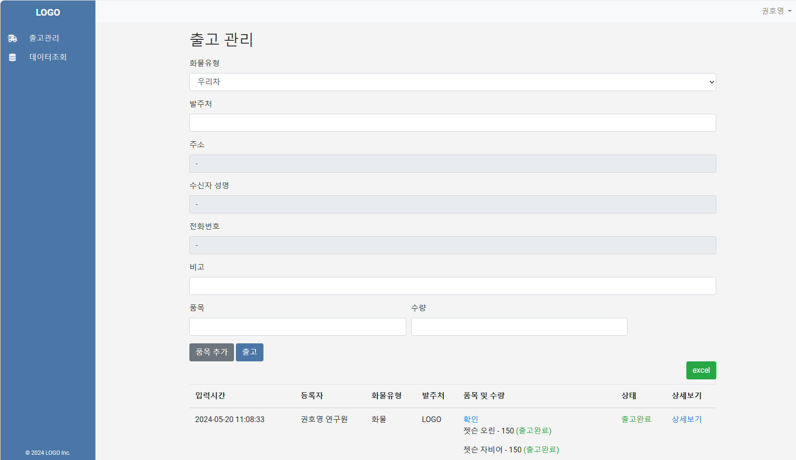

    
# 프로젝트 개요
   
이 프로젝트는 FastAPI를 사용한 구축된 출고 관리 시스템입니다. 웹 애플리케이션(경리부)에서 출고 요청 시 WebSocket을 통해 클라이언트(자재과)로 전송됩니다. 이후 클라이언트에서 출고 작업 후 출고 완료 및 출고 불가 처리를 하면 웹 애플리케이션에 해당 정보가 전송됩니다. SQLite를 데이터베이스로 사용하며 'uvicorn'을 통해 서비스 됩니다. NginX는 리버스 프록시로 사용되어 정적 파일을 제공합니다. NCP(https://www.ncloud.com/) 에 클라우드 기반 서버를 구축하고 SSL 인증서는 Let's Encrypt(https://letsencrypt.org/) 를 통해 발급받았습니다.
  
## 목차

- [프로젝트 개요](#프로젝트-개요)
- [기능](#기능)
- [아키텍처](#아키텍처)
- [사용법](#사용법)
- [라우트](#라우트)
- [종속성](#종속성)
 
## 기능

- 사용자 인증 및 등록
- 항목 관리 (추가, 업데이트, 목록 보기)
- 사용자 관리를 위한 관리자 대시보드
- WebSocket을 통한 실시간 알림
- CSV로 데이터 다운로드
- 반응형 HTML 템플릿

## 아키텍처

이 프로젝트의 아키텍처는 다음 구성 요소를 포함합니다:

1. **클라이언트 (브라우저)**: 클라이언트는 HTTP 요청을 보내고 응답을 받습니다.
2. **Nginx**: 요청을 FastAPI 애플리케이션으로 전달하고 정적 파일을 제공합니다.
3. **FastAPI 애플리케이션**: 애플리케이션의 핵심 로직을 처리하며 라우팅, 데이터베이스 작업, 실시간 통신을 포함합니다.
4. **Uvicorn**: FastAPI 애플리케이션을 실행하는 ASGI 서버입니다.
5. **SQLite**: 애플리케이션 데이터를 저장하는 데이터베이스입니다.
6. **WebSocket**: 실시간 통신 기능을 제공합니다.

### 워크플로우 다이어그램

```plaintext
+-------------------+      +-------+       +----------------+      +--------+      +-----------+
|                   |      |       |       |                |      |        |      |           |
|   Client Browser  +------> Nginx +-------> FastAPI (app)  +------> Uvicorn+------> SQLite DB |
|                   |      |       |       |                |      |        |      |           |
|  (HTTP Requests)  |      |       |       |    (ASGI App)  |      |        |      |           |
+-------------------+      +-------+       +----------------+      +--------+      +-----------+
             ^                    |                    ^                   |               ^
             |                    |                    |                   |               |
             |                    |                    |                   |               |
             |                    |                    |                   |               |
             |                    |                    |                   |               |
             |                    v                    |                   v               |
             |          +------------------+           |           +----------------+      |
             |          |  Static Files    |           |           |   WebSocket    |      |
             |          |  (CSS, JS, etc.) |           |           |                |      |
             |          +------------------+           |           +----------------+      |
             |                                         |                                   |
             |                                         |                                   |
             v                                         v                                   v
    +------------------+                  +-------------------+                 +----------------+
    |  HTML Templates  |                  |     API Routes    |                 |   DB Queries   |
    |  (Jinja2)        |                  |(user, item, admin)|                 |   (SQLAlchemy) |
    +------------------+                  +-------------------+                 +----------------+
```

## 사용법

애플리케이션이 실행 중이면, 브라우저에서 [http://127.0.0.1:8000](http://127.0.0.1:8000)로 접속할 수 있습니다.

- **로그인**: `/login/`
- **등록**: `/register/`
- **관리자 대시보드**: `/admin/`
- **항목 관리**: 메인 페이지에 접속하여 항목을 보고, 추가하고 관리할 수 있습니다.

## 라우트

### 사용자 라우트

- **GET** `/login/`: 로그인 페이지 렌더링
- **GET** `/register/`: 등록 페이지 렌더링
- **POST** `/register/`: 사용자 등록 처리
- **POST** `/token/`: 사용자 로그인 처리 및 JWT 토큰 반환
- **GET** `/logout/`: 액세스 토큰 삭제를 통해 사용자 로그아웃

### 항목 라우트

- **GET** `/`: 메인 항목 관리 페이지 렌더링
- **POST** `/add_item/`: 새 항목 추가
- **GET** `/items/`: 오늘 생성된 항목 목록
- **GET** `/items/by_date_range/`: 날짜 범위별 항목 목록
- **GET** `/download_csv/`: 항목을 CSV 파일로 다운로드

### 관리자 라우트

- **GET** `/admin/`: 관리자 대시보드 렌더링
- **POST** `/admin/approve/{user_id}`: 사용자 승인
- **POST** `/admin/delete/{user_id}`: 사용자 삭제
- **PUT** `/release_item/{grouped_item_id}`: 그룹화된 항목 릴리스

### WebSocket 라우트

- **GET** `/ws`: 실시간 알림을 위한 WebSocket 엔드포인트

## 종속성

- **FastAPI**: API를 구축하기 위한 웹 프레임워크
- **Uvicorn**: FastAPI를 실행하기 위한 ASGI 서버
- **SQLAlchemy**: 데이터베이스 작업을 위한 ORM
- **Jinja2**: HTML 페이지를 렌더링하기 위한 템플릿 엔진
- **Nginx**: 웹 서버 및 리버스 프록시
- **SQLite**: 애플리케이션 데이터를 저장하기 위한 데이터베이스
