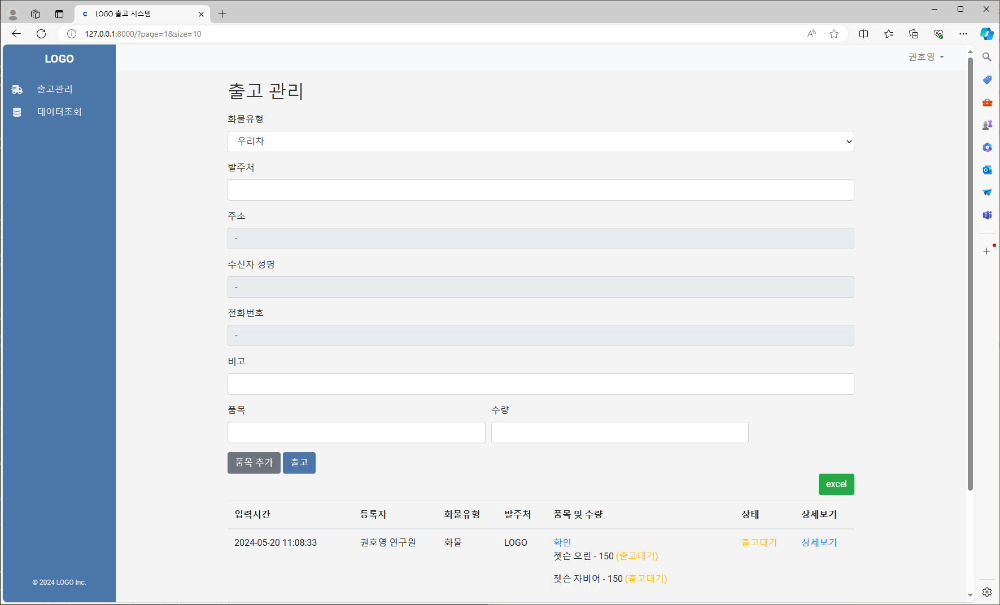

# Project Overview

This project is a web application built using FastAPI. It provides a user interface for managing items, includes authentication, and supports real-time communication through WebSocket. The application uses SQLite as the database and is served by `uvicorn`. Nginx is used as a reverse proxy and to serve static files.

## Table of Contents

- [Project Overview](#project-overview)
- [Features](#features)
- [Architecture](#architecture)
- [Usage](#usage)
- [Routes](#routes)
- [Dependencies](#dependencies)

## Features

- User authentication and registration
- Item management (add, update, list)
- Admin dashboard for user management
- Real-time notifications using WebSocket
- Download data as CSV
- Responsive HTML templates

## Architecture

The architecture of this project includes the following components:

1. **Client (Browser)**: The client sends HTTP requests and receives responses.
2. **Nginx**: Acts as a reverse proxy to forward requests to the FastAPI application and serves static files.
3. **FastAPI Application**: Handles the core logic of the application, including routing, database operations, and real-time communication.
4. **Uvicorn**: An ASGI server used to run the FastAPI application.
5. **SQLite**: The database used to store application data.
6. **WebSocket**: Provides real-time communication capabilities.

### Workflow Diagram

```plaintext
+-------------------+      +-------+       +----------------+      +--------+      +-----------+
|                   |      |       |       |                |      |        |      |           |
|   Client Browser  +------> Nginx +-------> FastAPI (app)  +------> Uvicorn+------> SQLite DB |
|                   |      |       |       |                |      |        |      |           |
|  (HTTP Requests)  |      |       |       |    (ASGI App)  |      |        |      |           |
+-------------------+      +-------+       +----------------+      +--------+      +-----------+
             ^                    |                    ^                   |               ^
             |                    |                    |                   |               |
             |                    |                    |                   |               |
             |                    |                    |                   |               |
             |                    |                    |                   |               |
             |                    v                    |                   v               |
             |          +------------------+           |           +----------------+      |
             |          |  Static Files    |           |           |   WebSocket    |      |
             |          |  (CSS, JS, etc.) |           |           |                |      |
             |          +------------------+           |           +----------------+      |
             |                                         |                                   |
             |                                         |                                   |
             v                                         v                                   v
    +------------------+                  +-------------------+                 +----------------+
    |  HTML Templates  |                  |     API Routes    |                 |   DB Queries   |
    |  (Jinja2)        |                  |(user, item, admin)|                 |   (SQLAlchemy) |
    +------------------+                  +-------------------+                 +----------------+

## Usage

Once the application is running, you can access it via your browser at [http://127.0.0.1:8000](http://127.0.0.1:8000).

- **Login**: `/login/`
- **Register**: `/register/`
- **Admin Dashboard**: `/admin/`
- **Item Management**: Access the main page to view, add, and manage items.

## Routes

### User Routes

- **GET** `/login/`: Render the login page.
- **GET** `/register/`: Render the registration page.
- **POST** `/register/`: Handle user registration.
- **POST** `/token/`: Handle user login and return a JWT token.
- **GET** `/logout/`: Log the user out by deleting the access token.

### Item Routes

- **GET** `/`: Render the main item management page.
- **POST** `/add_item/`: Add a new item.
- **GET** `/items/`: List items created today.
- **GET** `/items/by_date_range/`: List items by date range.
- **GET** `/download_csv/`: Download items as a CSV file.

### Admin Routes

- **GET** `/admin/`: Render the admin dashboard.
- **POST** `/admin/approve/{user_id}`: Approve a user.
- **POST** `/admin/delete/{user_id}`: Delete a user.
- **PUT** `/release_item/{grouped_item_id}`: Release grouped items.

### WebSocket Routes

- **GET** `/ws`: WebSocket endpoint for real-time notifications.

## Dependencies

- **FastAPI**: Web framework for building APIs.
- **Uvicorn**: ASGI server to run FastAPI.
- **SQLAlchemy**: ORM for database operations.
- **Jinja2**: Templating engine for rendering HTML pages.
- **Nginx**: Web server and reverse proxy.
- **SQLite**: Database for storing application data.
